# Codenrock New Year Code Battle
Решение 15 задач на алгоритмы по мотивам IT сериалов в рамках соревнования: "Codenrock New Year Code Battle".  
<https://codenrock.com/contests/codenrock-new-year-code-battle/>  
15 крутых задач в тематике сериалов «Мир Дикого Запада», «Мистер Робот», «Кремниевая Долина» и других: "IT Show Code Battle".  
<https://codenrock.com/contests/it-show-code-battle/>

1. [Алфавит](#алфавит)
2. [Война](#война)
3. [Взлом двери](#взлом-двери)
4. [Наивный RLE](#наивный-rle)
5. [Имя Фамилия](#имя-фамилия)
6. [GAME OVER](#game-over)
7. [Литорея](#литорея)
8. [Шифр четырех квадратов](#шифр-четырех-квадратов)
9. [Алгоритм Барроуза-Уилера](#алгоритм-барроуза-уилера)
10. [Обратное преобразование Алгоритма Барроуза-Уилера](#обратное-преобразование)
11. [Минное поле](#минное-поле)
12. [Диалоговое дерево](#диалоговое-дерево)
13. [Шифрование](#шифрование)
14. [Инвесторы](#инвесторы)
15. [Нонограмма](#нонограмма)

## Алфавит
### Задание
Зашифруйте сообщение меняя буквы на их порядковый номер в алфавите. Пробелы при этом не учитывать. Строки будут даны без знаков препинания, только с пробелами. Регистр не учитывать.  

**Входные данные:** шифруемая строка, длиной до 1000 символов, на латинице  
**Пример входных данных:** MR Robot  
**Выходные данные:** через запятую порядковый номер букв в алфавите  
**Пример выходных данных:** 13,18,18,15,2,15,20  

### Код (alphabet.py)
```python
import sys
import string

alphabet = string.ascii_lowercase  # latin alphabet

def encode(line):
    line = line.replace(" ", "").rstrip('\n')
    ind_list = [alphabet.find(x) + 1 for x in line.lower()]
    print(','.join(map(str, ind_list)))

if __name__ == '__main__':
    for line in sys.stdin:  # get input strings one by one
        encode(line)
```
## Война
### Задание
В мире Дикого запада идет война. Главнокомандующие разработали стратегию клина, чтобы сбить ряды противника. Чтобы образовать клин надо знать число человек в ряду противника, т.к. в задней части клина количество участников равно количеству человек в ряду у противника. В каждом ряду клина на два участника меньше, чем в предыдущем ряду. На острой части клина может быть либо 2 либо 1 участник. Так если в ряду у противника 9 человек, то ряды клина состоят из такого количества человек: 9 7 5 3 1. Или для 6 человек в ряду у противника: 6 4 2. По введенному числу количества человек в ряду у противника, найдите количество человек в клину. Количество человек у противника может достигать 100.  

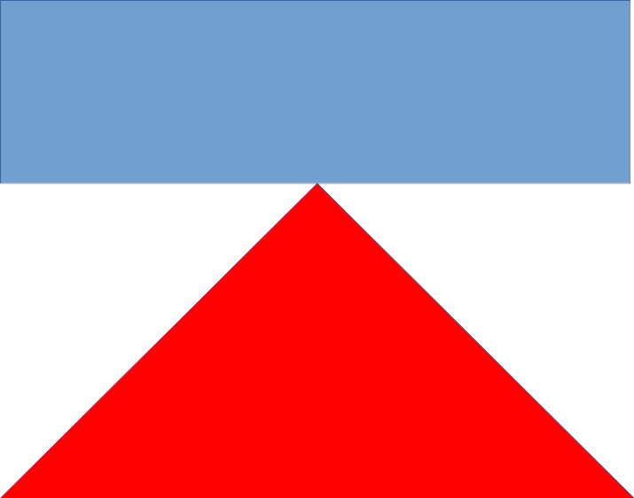

**Пример входных данных:** 9  
**Пример выходных данных:** 25  

### Код (warfare.py)
```python
import sys
import math

def sum_of_arithmetic_progression(a1, d, n):
    return (2*a1 + d*(n - 1))*n/2

def warfare(line):
    opponents = float(line)
    n = math.ceil(opponents/2) # round up
    S = sum_of_arithmetic_progression(opponents, -2, n)
    print(int(S)) # print the answer to stdout

if __name__ == '__main__':
    for line in sys.stdin: # get input strings one by one
        warfare(line)
```
## Взлом двери
### Задание
Дарлин взламывает тумбочку в квартире Эллиота. Замочна скважина устроена из барьеров, которые не позволяют сдвинуть замок и соответствуют прорезям на ключе. Когда ключ поворачивается, он поворачивает то пространство где нет барьеров. На картинке барьеры показаны красным цветом. Дарлин замерила расстояние от входа в замочную скважину, до начала каждого барьера, они равны целым числам. Чтобы взломать замок, достаточно вставить в каждый промежуток между барьерами,а так же до первого барьера и после последнего палочки диаметром 1 и повернуть их одновременно.  
Расстояние между барьерами во входных данных не может быть меньше чем 1. Каждый барьер толщиной 1. Барьеров может быть от 1 до 3. Ваша задача вывести модель самодельного ключа Дарлин, где каждая палочка будет надета на основу, равную длине замка, каждая палочка высотой 3, в каждом промежутке между барьерами каждая палочка будет ближе к правой стороне.

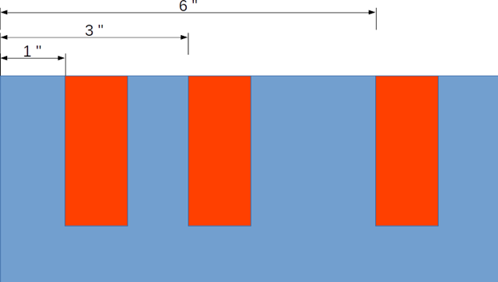

**Входные данные:** расстояния от начала замочной скважины, до каждого барьера, и общая длина замочной скважины  
**Пример входных данных:** 1,3,6,8  
**Выходные данные:** нарисованная модель ключа Дарлин, где X - ключ, 0 - пустое пространство.  
**Пример выходных данных (для замка с картинки):**  
X0X00X0X  
X0X00X0X  
X0X00X0X  
XXXXXXXX  

### Код (hacking_door.py)
```python
import sys

def hacking_door(line):
    res = list(filter(lambda x : x.isdigit(), line.split(",")))
    sticks = [int(x) for x in res[:-1]]
    length = int(res[len(res) - 1])
    key = []
    for i in range(length):
        if (i+1 in sticks or i+1 == length):
            key.append('X')
        else:
            key.append('0')
    for i in range(3):
        print(*[x for x in key], sep='')
    print(*['X' for x in range(length)], sep='')

if __name__ == '__main__':
    for line in sys.stdin:
        hacking_door(line)
```
## Наивный RLE
### Задание
RLE - самый простой алгоритм сжатия. Его суть состоит в замене повторяющихся данных образцом, и количеством повтора образца. Алгоритм подходит для сжатия данных, имеющих большое количество повторений. Напишите программу, которая реализует RLE для строк, состоящих из букв латинского алфавита, не имеющих пробелы. При сжатии учитывайте регистр. Во входных данных только одна строка. 

**Например:** DDDDFFFFHHHHk → 4D,4F,4H,1k

### Код (simple_rle.py)
```python
import sys

def encode_message(message):
    encoded_string = ""
    i = 0
    while (i < len(message)):
        count = 1
        ch = message[i]
        while (i < len(message)-1): 
            if (message[i] == message[i + 1]): 
                count += 1
                i += 1
            else: 
                break
        encoded_string += str(count) + ch + ','
        i += 1
    return encoded_string[:-1]

if __name__ == '__main__':
    for line in sys.stdin:
        print(encode_message(line[:-1]))
```
## Имя Фамилия
### Задание
Эллиот хочет получить все имена и фамилии из текста. Для этого он находит все пары слов, которые идут друг за другом и начинаются с заглавной буквы. Напишите программу способную это сделать. Если между двумя подходящими словами стоит любой знак кроме пробела, то эту пару слов не считать Именем Фамилией, но могут встречаться повторяющиеся пробелы, в таком случае подходящая пара остается Именем и Фамилией. Входные данные представлены на русском языке и исключают возможность появления трех и более слов, удовлетворяющих условию поиска, подряд. Имя и фамилию ищите на русском языке. Текст длиной не более 2000 символов. 

**Пример входных данных:** “В качестве выкупа fsociety вынуждает Скотта Ноулза надеть маску fsociety и публично сжечь 5,9 миллиона долларов полученных от взлома. Анджела Мосс продолжает подниматься по карьерной лестнице в E Corp, по-видимому, довольная своей новой корпоративной позицией, и, похоже, отказывается от иска. Джоанна получает подарок на пороге - музыкальную шкатулку со спрятанным под ней телефоном, но пропускает звонок. Эллиот обнаруживает, что действовал под влиянием Мистера Робота, когда думал, что спит. Человек по имени Брок убивает Гидеона, который ранее угрожал сообщить о подозрительном поведении Эллиота в Олсейф ФБР и агенту Доминик ДиПьерро. Эллиот просыпается от диссоциативного состояния, разговаривая по телефону, его приветствует на другом конце провода Тайрелл.”  
**Пример выходных данных:** “Скотта Ноулза, Анджела Мосс, Мистера Робота, Олсейф ФБР, Доминик ДиПьерро”

### Код (name_search.py)
```python
import sys
import re 

def name_search(text):
    return re.findall(r'[А-Я][А-Яа-я]+\s+[А-Я][А-Яа-я]+[^A-za-z]', text)

if __name__ == '__main__':
    for line in sys.stdin:
        print(*[x[:-1] for x in name_search(line)], sep=', ')
```
## GAME OVER
### Задание
Бернард смотрит, что происходит в парке в разные моменты времени. Он хочет знать в каком состоянии находились машины в нужное ему время. Они находятся в двух состояниях: либо они играют (GAME CONTINUES), либо они находятся на починке (GAME OVER). Вам будут даны интервалы времени, когда роботы находились на починке, и время, которое интересовало Бернарда. Бернард смотрит данные за последний месяц, поэтому он вводит число и время, например, 2-е число 15 часов 13 минут: 2 15:13. Кол-во роботов не превышает 10, кол-во дат в запросе не больше 10. Время ремонта робота включает в себя границы заданных промежутков времени.  

**Входные данные:** Сначала идет список роботов (R) в виде: Имя | даты поломки через запятую в формате "DD HH:MM"  
                    Далее идёт список времени (T), которое интересовало Бернарда в формате "DD HH:MM"  
**Пример входных данных:**  
R:Тедди| 4 18:12 - 6 19:32, 17 13:12 - 20 14:42   
R:Долорес| 12 14:12 - 12 18:15   
R:Мейв| 13 9:21 - 13 21:23, 14 7:23 - 15 12:12 , 17 18:00 - 19 23:22, 22 20:25 - 26 15:14   
R:Питер| 8 9:05 - 10 4:55   
R:Клементина| 15 4:00 - 16 14:43   
T:8 14:21  
T:17 19:17  
**Выходные данные:** дата, состояния роботов  
**Пример выходных данных:**  
8 14:21  
Тедди GAME CONTINUES  
Долорес GAME CONTINUES  
Мейв GAME CONTINUES  
Питер GAME OVER  
Клементина GAME CONTINUES  
17 19:17  
Тедди GAME OVER  
Долорес GAME CONTINUES  
Мейв GAME OVER  
Питер GAME CONTINUES  
Клементина GAME CONTINUES  

### Код (game_over.py)
```python
import sys
import re 

def parsing_R(line):
    name = re.search(r'[А-Яа-я]+', line)
    days = [int(x) for x in re.findall(r' \d+ ', line)]
    hours = [int(x[:-1]) for x in re.findall(r' \d+:', line)]
    minutes = [int(x[1:]) for x in re.findall(r':\d+', line)]
    return name[0], days, hours, minutes

def parsing_T(line):
    day = int(re.search(r'^\d+ ', line)[0])
    hour = int(re.search(r' \d+:', line)[0][:-1])
    minute = int(re.search(r':\d+', line)[0][1:])
    return day, hour, minute

def search(robots, periods): 
    for i in range(len(periods)):
        print(f"{periods[i][0]} {periods[i][1]}:{periods[i][2]}")
        for j in range(len(robots)):
            game = True
            for k in range(0, len(robots[j][1]), 2):
                if periods[i][0] > robots[j][1][k] and periods[i][0] < robots[j][1][k+1]:
                    game = False
                elif periods[i][0] == robots[j][1][k]:
                    if periods[i][1] > robots[j][2][k]:
                        game = False
                    elif periods[i][1] == robots[j][2][k]:
                        if periods[i][2] >= robots[j][3][k]:
                            game = False
                elif periods[i][0] == robots[j][1][k+1]:
                    if periods[i][1] < robots[j][2][k+1]:
                        game = False
                    elif periods[i][1] == robots[j][2][k+1]:
                        if periods[i][2] <= robots[j][3][k+1]:
                            game = False
            if game:
                print(f"{robots[j][0]} GAME CONTINUES")
            else:
                print(f"{robots[j][0]} GAME OVER")

if __name__ == '__main__':
    robots = []
    periods = []
    for line in sys.stdin: 
        if (line[0] == 'R'):
            robots.append(parsing_R(line[2:]))
        elif (line[0] == 'T'):
            periods.append(parsing_T(line[2:]))
        elif (line[0] == '0'): 
            search(robots, periods)
```
## Литорея
### Задание
Литорея - метод шифрования русского алфавита. Е и Ё объединяют, а остальные 32 символа разделяют на 2 группы по 16 штук, внутри группы производится зеркальная замена букв, что ближе к концу по местоположению в группе на те, что ближе к началу и наоборот. Например, 1-я буква заменяется на 16-ю, а - п, 3-я буква заменяется на 14-ю в-н. Реализуйте данный метод шифрования, учитывая регистр. 

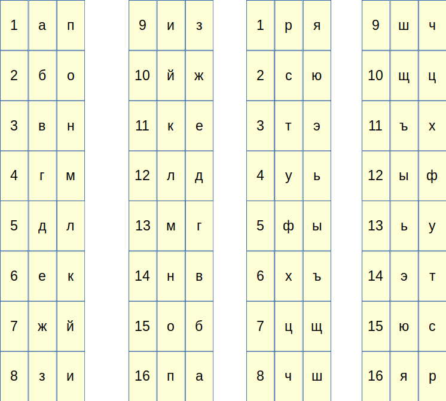

**Входные данные:** строка на русском языке до 100 символов  
**Пример входных данных:** Мир это опасное место  
**Выходные данные:** зашифрованная строка  
**Пример выходных данных:** Гзя тэб бапювбк гкюэб  

### Код (littera.py)
```python
import sys

def mirror_replace(c, init):
    left_key = ord(c) - init + 1
    area = left_key // 17
    in_area = left_key - 16*area
    right_code = abs(in_area - 16) + 16*area
    return chr(init + right_code)

def encode(line):
    code = ""
    for c in line.replace('ё','е').replace('Ё','Е'):
        if c.isupper():
            code += mirror_replace(c, ord('А'))
        elif c.islower():
            code += mirror_replace(c, ord('а'))
        else: #elif c == ' ':
            code += c
    return code
            
if __name__ == '__main__':
    for line in sys.stdin:
        print(encode(line))
```

## Шифр четырех квадратов
### Задание
Шифр четырех квадратов использует 4 квадратных матрицы, размером зависящих от количества букв в алфавите, например, 5х5 в английском языке. Две из них заполняются алфавитом в стандартном порядке. Чтобы добиться подходящего размера либо «I» и «J» объединяются в одной клетке, либо «Q» опускается. В две оставшиеся таблицы помещаются ключевые слова в верхней строке слева направо. Потом в оставшиеся ячейки матрицы записываются по порядку символы алфавита, не встречающиеся в ключевом слове.  

Для шифрования необходимо выполнить следующие пункты:
1. Разделить сообщение на биграммы: *ATTACK AT DAWN = AT TA CK AT DA WN*
2. По очереди найти их в левом верхнем и правом нижнем квадрате. Например, *AT*.
3. Комплементарно найденным буквам выбрать другие 2 буквы из правого верхнего и левого нижнего квадратов — *PM*. При этом все четыре буквы должны находиться в вершинах прямоугольника. Полученную пару букв помещают в шифр слева направо.
4. Повторить для всех пар букв, содержащихся в сообщении. Если сообщение состоит из нечетного количества букв последнюю букву в кодируемом сообщении оставляем как есть. 
5. В итоге получается зашифрованное сообщение: *PM MU TB PM CU XH = PMMUTBPMCUXH*

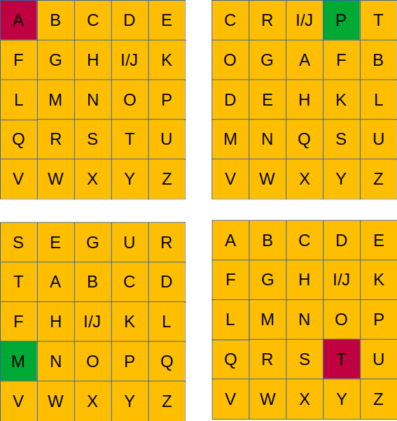

**Входные данные:** шифруемая строка, длиной до 100 символов, на латинице в верхнем регистре  
**Пример входных данных:** I WANTED TO SAVE THE WORLD  
**Выходные данные:** зашифрованная строка  
**Пример выходных данных:** GYIFUUPPHPCVPQBGYHMHD  

### Код (four_squares.py)
```python
import sys
import string
import re

def get_key_alph(alphabet, key_word):
    for c in alphabet:
        if c not in key_word:
            key_word += c
    return key_word

def encode(mes_input, alphabet, key_alph):
    mes_output = ""
    pos = 0
    while pos < len(mes_input):
        if pos+1 < len(mes_input):
            idx11 = alphabet.find(mes_input[pos])
            idx22 = alphabet.find(mes_input[pos+1])
            idx12 = idx11//5*5 + idx22%5
            idx21 = idx22//5*5 + idx11%5
            mes_output += key_alph[0][idx12]
            mes_output += key_alph[1][idx21]
        else:
            mes_output += mes_input[pos]
        pos += 2
    return mes_output

if __name__ == '__main__':
    alphabet = string.ascii_uppercase.replace('J','')
    key_alph1 = get_key_alph(alphabet, "CRIPTOGAF")
    key_alph2 = get_key_alph(alphabet, "SEGURT")
    for line in sys.stdin:
        mes_input = re.sub(r"[\sJ]", "", line)
        print(encode(mes_input, alphabet, (key_alph1, key_alph2)))
```

## Алгоритм Барроуза-Уилера
### Задание
Напишите программу преобразования Барроуза-Уилера, которое используется перед применением алгоритма сжатия RLE, для большей его эффективности. Преобразование выполняется в три этапа:  
1. Составляется таблица всех циклических сдвигов входной строки.
2. Производится лексикографическая (в алфавитном порядке) сортировка строк таблицы. Лексикографическая сортировка происходит в соответствии с кодировкой Unicode.
3. В качестве выходной строки выбирается последний столбец таблицы преобразования и номер строки, совпадающей с исходной.

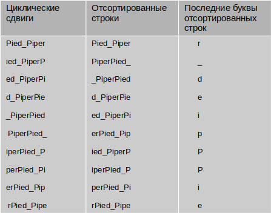

**Входные данные:** шифруемая строка, длиной до 100 символов  
**Пример входных данных:** Pied_Piper  
**Выходные данные:** зашифрованная строка  
**Пример выходных данных:** r_deipPPie  

### Код (burrows_wheeler.py)
```python
import sys

def transformation(input):
    if len(input) == 0:
        return None
    cycle_list = sorted([input[i+1:]+input[:i+1] for i in range(len(input))])
    output = ""
    for s in cycle_list:
        output += s[len(s)-1]
    return output

if __name__ == '__main__':
    for line in sys.stdin:
        print(transformation(line[:-1]))
```

## Обратное преобразование Алгоритма Барроуза-Уилера
### Задание
Напишите программу, которая делает обратное преобразование Алгоритма Барроуза-Уилера. Алгоритм заключается в разбиении входной строки (уже преобразованной алгоритмом) на последовательность символов, которые записываюся в столбик (добавление 1). Образованные строки лексикографически сортируются (сортировка 1), а после к полученному добавляют слева символы из добавления 1 (добавление 2). Снова сортируют, продолжая таким образом, пока количество символов в полученных строках не станет равным количеству символов во входной строке. При любом добавлении добавляем символы из первого столбца. В конце образуется столбец, где искомая строка это строка c символом конца строки '|'. Или же выбирается строка с номером, который был изначально дан.

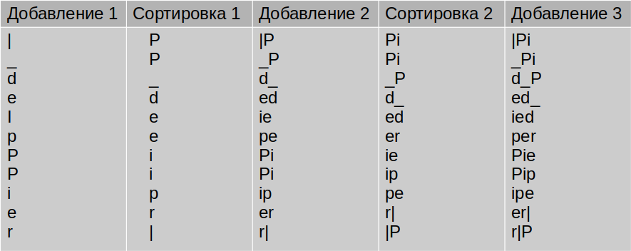

**Входные данные:** строка, зашифрованная алгоритмом Барроуза-Уилера, длиной до 100 символов  
**Пример входных данных:** |_deipPPier  
**Выходные данные:** расшифрованная строка  
**Пример выходных данных:** Pied_Piper|

### Код (burrows_wheeler_re.py)
```python
import sys

def re_transformation(input):
    if len(input) == 0:
        return None
    re_cycle_list = ["" for s in input]
    while len(re_cycle_list[0]) < len(input):
        re_cycle_list = sorted([input[i]+re_cycle_list[i] for i in range(len(input))])
    for s in re_cycle_list:
        if s[len(s)-1] == '|':
            return s

if __name__ == '__main__':
    for line in sys.stdin:
        print(re_transformation(line[:-1]))
```

### Минное поле
## Задание
Долорес с Уильямом попали в необычное минное поле. Поле прямоугольное, поделено на меньшие клетки, мины расположены в клетках в шахматном порядке. X - мины, Z - взорванные мины, D - местоположение Долорес, W - местоположение Уильяма, 0 - пустое пространство. Изначально Уильям и Долорес стоят на пустом пространстве. Ваша задача найти ранит ли мина Долорес. 

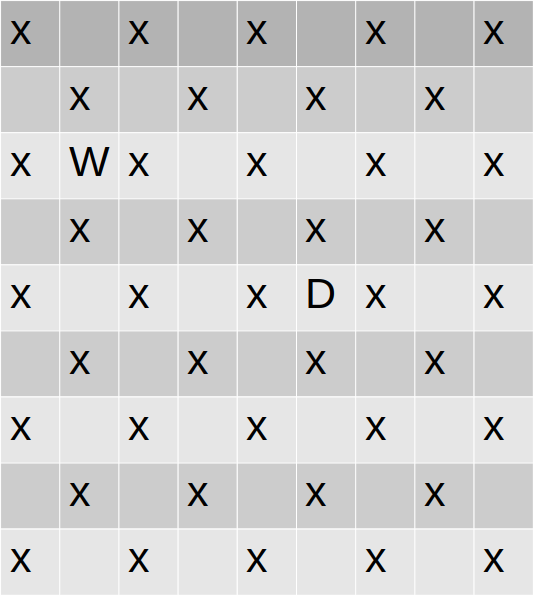

Мины могут ранить только Долорес, но не Уильяма. Мины взрываются от Уильяма, но не от Долорес. Если на мину наступит Уильям, то эта мина взорвется и взорвутся все по диагонали от нее. В первый момент все мины целы, после чего Долорес и Уильям делают шаг, каждый в заданную им сторону, при этом Долорес может ранить, если она окажется в клетке с миной, взорванной Уильямом. На рисунках ниже, представлен пример, как взрываются мины, когда Уильям встал на одну из них, которая в том числе взорвется. 


**Входные данные:** минное поле, вместе с расположением Долорес и Уильяма. Шаги в одном из направлений: right, left, up, down. Сначала шаг Долорес, потом Уйльяма. Шаг делается только один.  
**Пример входных данных:**  
X0X0X0X0X  
0X0X0X0X0  
XWX0X0X0X  
0X0X0X0X0  
X0X0X0X0X  
0X0X0X0X0  
X0X0X0X0X  
0X0X0X0X0  
X0X0XDX0X  
right  
left  
**Выходные данные:** Yes, если ранило, No если нет  
**Пример выходных данных:** Yes

### Код (minefield.py)
```python
import sys

def diagonal_check(a, b):
    if abs(a[0]-b[0]) == abs(a[1]-b[1]):
        print("Yes")
    else:
        print("No")

def get_idx_after_step(step, idx, size):
    if step == "right" and idx[1] + 1 < size[1]:
        return idx[0], idx[1] + 1
    elif step == "left" and idx[1] - 1 >= 0:
        return  idx[0], idx[1] - 1
    elif step == "down" and idx[0] + 1 < size[0]:
        return  idx[0] + 1, idx[1]
    elif step == "up" and idx[0] -1 >= 0:
        return idx[0] - 1, idx[1]
    else:
        return idx[0], idx[1]

def minefield(data):
    matrix = data.split("\n")[:-2]
    step_D = data.split("\n")[-2] # Dolores
    idx_D = [(idx, row.index('D')) for idx, row in enumerate(matrix) if 'D' in row][0]
    idx_D = get_idx_after_step(step_D, idx_D, (len(matrix), len(matrix[0])))
    step_W = data.split("\n")[-1] # William
    idx_W = [(idx, row.index('W')) for idx, row in enumerate(matrix) if 'W' in row][0]
    idx_W = get_idx_after_step(step_W, idx_W, (len(matrix), len(matrix[0])))
    if matrix[idx_W[0]][idx_W[1]] == 'X':
        diagonal_check(idx_W, idx_D)
    else:
        print("No")

if __name__ == '__main__':
    data = ""
    for line in sys.stdin: 
        data += line
    minefield(data)
```

### Диалоговое дерево
## Задание
Речь Мейв представлена в виде диалогового дерева, где каждый путь это возможный вариант продолжения разговора. Вам будет дано представление дерева возможных вариантов разговора Мейв. Необходимо найти количество всевозможных диалогов, которые состоят из 6 узлов и более. Корень дерева обозначается 1. Количество узлов может доходить до 100.  

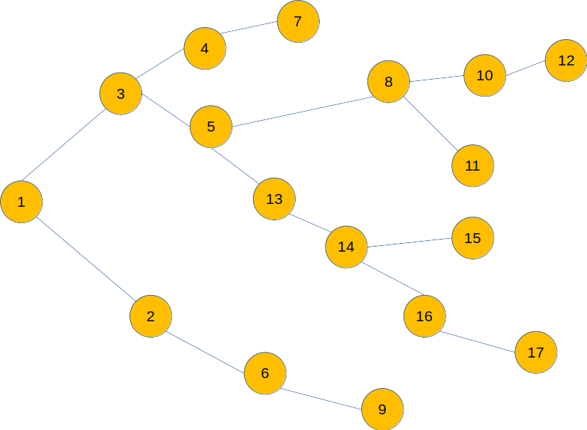

Например, на картинке изображено 3 диалога с длиной пути от 6-ти узлов и более:  
1-3-5-8-10-12  
1-3-5-13-14-15  
1-3-5-13-14-16-17  

**Входные данные:** диалоговое дерево, представленное в виде связи родительских узлов с дочерними, где сначала указан родительский узел, через двоеточие его дочерние узлы, если узла нет среди родительских, то значит у этого узла нет дочерних элементов  
**Пример входных данных:** 1:2,3 2:6 3:4,5 4:7 5:8,13 6:9 8:10,11 10:12 13:14 14:15,16 16:17  
**Выходные данные:** количество диалогов, состоящих из 6 узлов и более  
**Пример выходных данных:** 3  

### Код (dialogue_tree.py)
```python
import sys
import re
    
def dialogue_count(graph, start, current, total):
    current += 1
    if graph.get(start,None) == None:
        if current >= 6:
            return total + 1
    else:
        for node in graph[start]:
            total = dialogue_count(graph, node, current, total)
    return total

def build_graph(data):
    nodes = data.split("\n")
    graph = {}
    for node in nodes:
        graph[re.split(":|,", node)[0]] = set(re.split(":|,", node)[1:])
    return graph

if __name__ == '__main__':
    data = ""
    for line in sys.stdin: 
        data += line
    print(dialogue_count(build_graph(data), '1', 0, 0))
```

### Шифрование
## Задание
Зашифруйте сообщение с помощью перестановки букв внутри слов и шифра Цезаря. Дана строка, её надо разбить по словам. каждое слово зашифровать подстановкой, для каждой буквы в слове определить её порядок в алфавите, а потом сдвинуть на это число с помощью шифра Цезаря. Регистр сохраняется на протяжении всех манипуляций.

Чтобы совершить перестановку, условно берем пустое поле, состоящее из *n* клеток, где *n* - количество букв в слове и добавляем в поле буквы шифрованного слова. Для вставки каждой следующей буквы отсчитываем две пустые клетки в поле, относительно незаполненных клеток, если при отсчете натыкаемся на тупиковую клетку поля, то меняем направление отсчета, и отсчитываем дальше по незаполненным клеткам. Первая буква слова идет на вторую позицию, вторую букву вставляем на две позиции дальше, относительно незаполненных позиций, и т.д. Последняя буква попадает в оставшуюся пустой клетку. То что получилось в поле и есть шифрованное слово. Пример со словом "something":  


Для кодирования шифром Цезаря, каждая буква кодируемого слова сдвигается вправо на шаг, равный номеру в алфавите первой буквы в слове, получившемся в результате перестановки. Если смещение зашифрованной буквы больше, чем количество символов в алфавите, смещение продолжается с нулевой позиции. Пример шифрования, при сдвиге равном 3-м:  


**Входные данные:** кодируемая строка  
**Пример входных данных:** When you delete something, you are making a choice to destroy it. To never see it again.  
**Выходные данные:** зашифрованная строка  
**Пример выходных данных:** jBsm dnj jijjyq bgvcwahsu, dnj jsw ntphur b jhnmht di jvqwlkg nc. dI jfnww jxj nc boouw.  

### Код (encryption.py)
```python
import sys
import re
import string

alph_lower = string.ascii_lowercase  # lowercase latin alphabet
alph_upper = string.ascii_uppercase  # uppercase latin alphabet

def direction(course, count, step, size):
    if course and count + 1 == size:
        return False, count, 0
    elif course and count + 1 < size:
        return True, count + 1, step
    elif not course and count - 1 == -1:
        return True, count, 0
    elif not course and count - 1 > -1:
        return False, count - 1, step

def transposition(word): # nshoimteg
    after_change = [None]*len(word)
    course = True
    count = -1
    for i in range(len(word)):
        step = 0
        while (step != 2):
            course, count, step = direction(course, count, step, len(word))
            if after_change[count] == None:
                step += 1
                if step == 2:
                    after_change[count] = word[i]
                if i + 1 == len(word):
                    after_change[count] = word[i]
                    step = 2
    return ''.join(after_change)

def caesar(word): # bgvcwahsu
    step = alph_lower.index(word[0].lower())
    mod_func = lambda z,s: (alph_lower.find(z) + s)%25
    div_func = lambda z,s: (alph_lower.find(z) + s)//25
    char_list = [alph_lower[mod_func(x,step) - div_func(x,step) + 1] for x in word.lower()]
    char_list = [x.upper() if y.isupper() else x for x, y in zip(char_list, word)]
    return ''.join(char_list)

def encryption(data):
    words = re.findall(r'[0-9]+|[A-z]+|.|,|\?|!|"|\'', data)
    words = [caesar(transposition(word)) if re.match(r'[0-9]+|[A-z]+', word) else word for word in words]
    return "".join(words)

if __name__ == '__main__':
    data = "" 
    for line in sys.stdin: 
        data += line # something
    print(encryption(data))
```

### Инвесторы
## Задание
Ричард и Эрлих идут на переговоры с *k* инвесторами. У них два метода ведения переговоров, либо вести себя по-хамски, тем самым не дать прогнуть себя, либо вести себя прилично. У них только *n* дней, для того, чтобы представить свой проект, всем инвесторам. Они понимают, что если вести себя по-хамски, то инвесторы не будут посылать их на повторные переговоры, но успех при этом будет сомнителен. Если же они будут себя вести прилично, то инвесторы будут наглеть и устраивать больше встреч. Ричард и Эрлих изначально составляют план, сколько времени они готовы тратить на каждого инвестора. Если они готовы рискнуть, то они будут вести себя максимально неприлично, на этого инвестора планируют немного дней. Если же инвестор стоит того, и они готовы тратить время, чтобы представлять проект снова и снова, то они будут терпеливы, и планируют больше дней. Также, так как у них ограничено время, то они могут просто не пойти на встречу. Ричард для каждого инвестора составил неубывающую функцию зависимости вероятности успеха ведения переговоров от количества дней, потраченных на инвестора. Таблица составлена для 5 дней и 4 инвесторов.  

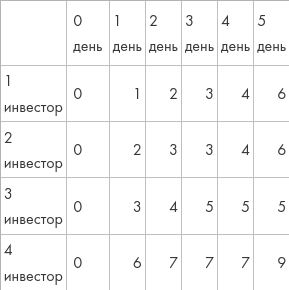

Ричард считает успешной стратегию, при которой сумма вероятностей успехов максимальна. Задача состоит в том, чтобы найти максимальную суммарную вероятность для входных данных. Подразумевается решение методом **динамического программирования**. Для данных из таблицы выше успешная стратегия, при которой максимальная суммарная вероятность равна 13, следующая:  

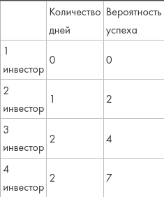

**Входные данные:** k (k ≤ 20), n (n ≤ 20), функции успеха   
**Пример входных данных:**   
4  
5  
1,2,3,4,6  
2,3,3,4,6  
3,4,5,5,5  
6,7,7,7,9  
**Выходные данные:** максимальная суммарная вероятность  
**Пример выходных данных:** 13  

### Код (investors.py)
```python

```

### Нонограмма
## Задание
Японский кроссворд (по-другому, нонограмма) — это головоломка, в которой зашифровано изображение. Дается поле с горизонатальными и вертикальными подсказками. Эти подсказки указывают количество клеток, которые надо закрасить, в столбце - при горизонтальных подсказках, в строке - при вертикальных. Если в подсказке одно число *n*, то это значит, что надо закрасить *n* клеток подряд. Если несколько чисел, к примеру два числа *n* и *k*, то это значит что надо сначала закрасить *n* клеток подряд, потом должен быть хотя бы один пробел, после чего закрашивается *k* клеток подряд. Ваша задача написать решатель нонограммы размером 5 на 5.  

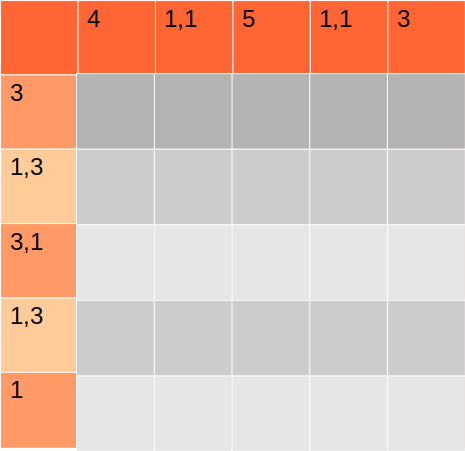


**Входные данные:** сначала горизонтальные подсказки, потом вертикальные. При горизонтальных подсказках, если пишется несколько цифр, то сначала написано количество закрашенных клеток, что расположены выше, потом ниже. При вертикальных, сначала слева, потом справа  
**Пример входных данных:**   
4 1,1 5 1,1 3  
3 1,3 3,1 1,3 1  
**Выходные данные:** получившаяся картинка в пикселях, где X - закрашенные пиксели, а пустое пространство обозначается прочерком -  
**Пример выходных данных:**   
XXX--  
X-XXX  
XXX-X  
X-XXX  
--X--  

### Код (nonograms.py)
```python

```
