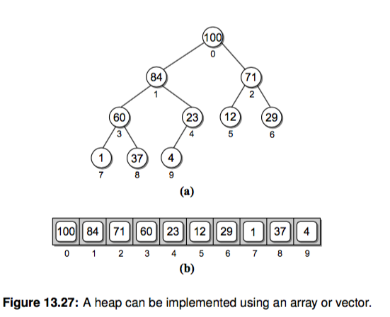
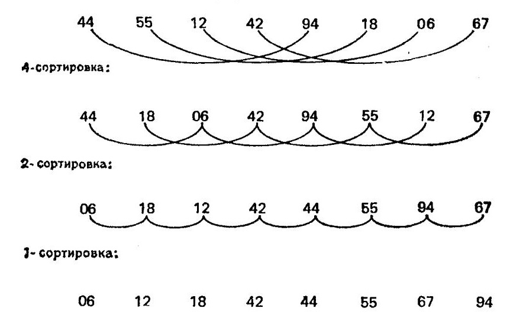

# Popular sorting algorithms
Решение практических заданий по курсу: "Популярные алгоритмы сортировки: практический мини-курс от Codenrock".  
<https://codenrock.com/contests/popular-sorting-algorithms-by-codenrock/>   

1. [Bubble Sort (Сортировка пузырьком)](#bubble-sort): Один из простейших алгоритмов сортировки.  
2. [Selection Sort (Сортировка выбором)](#selection-sort): Из неотсортированной части массива извлекаем элементы и перенаправляем их в отсортированную область.  
3. [Insertion Sort (Сортировка вставками)](#insertion-sort): Разновидность сортировки выбором.  
4. [Merge Sort (Сортировка слиянием)](#merge-sort): Сортирует такие структуры данных, где доступ к элементам осуществляется последовательно.  
5. [Quick Sort (Быстрая сортировка)](#quick-sort): Один из самых эффективных методов сортировки.  
6. [Heap Sort (Пирамидальная сортировка)](#heap-sort): Метод сортировки сравнением, основанный на такой структуре данных как двоичная куча.  
7. [Shell Sort (Сортировка Шелла)](#shell-sort): Усовершенствованный вариант сортировки вставками.  

## Bubble Sort
### Теория
Сортировка пузырьком - это метод сортировки массива, который можно представить как следующий процесс:
1. Начни с первого элемента массива (пусть это будет "пузырек").
2. Сравни этот элемент (пузырек) со следующим элементом.
3. Если текущий элемент больше следующего элемента, поменяй их местами. Если нет, оставь их как есть.
4. Перейди к следующему элементу и повтори шаги 2-3 для всех оставшихся пар элементов в массиве.
5. После прохода по всему массиву самый большой элемент "всплывет" в конец массива, как пузырек в воде.
6. Теперь повтори этот процесс для всех элементов массива, кроме последнего (поскольку он уже отсортирован). Затем продолжай исключать по одному элементу с конца массива, пока не отсортируешь весь массив.


[5 8 3 1 4] - сравниваем 5 и 8, оставляем без изменений  
[5 8 3 1 4] - сравниваем 8 и 3, меняем местами  
[5 3 8 1 4] - сравниваем 8 и 1, меняем местами  
[5 3 1 8 4] - сравниваем 8 и 4, меняем местами  
[5 3 1 4 8] - завершили первый проход  

[5 3 1 4 8] - сравниваем 5 и 3, меняем местами  
[3 5 1 4 8] - сравниваем 5 и 1, меняем местами  
[3 1 5 4 8] - сравниваем 5 и 4, меняем местами  
[3 1 4 5 8] - сравниваем 5 и 8, оставляем без изменений  
[3 1 4 5 8] - завершили второй проход  

[3 1 4 5 8] - сравниваем 3 и 1, меняем местами  
[1 3 4 5 8] - сравниваем 3 и 4, оставляем без изменений  
[1 3 4 5 8] - сравниваем 4 и 5, оставляем без изменений  
[1 3 4 5 8] - завершили третий проход  

[1 3 4 5 8] - сравниваем 1 и 3, оставляем без изменений  
[1 3 4 5 8] - завершили четвертый проход  

Теперь массив отсортирован: [1 3 4 5 8]

В итоге, в процессе сортировки пузырьком мы проходим по массиву много раз, на каждом проходе "всплывая" самый большой элемент из непосредственно неотсортированных элементов на правильное место. Это продолжается до тех пор, пока весь массив не будет отсортирован.

### Когда использовать?
Сортировка пузырьком (Bubble Sort) обычно не используется в реальных проектах из-за своей низкой эффективности ***O(n^2)***, особенно для больших наборов данных. Однако, есть ситуации, в которых Bubble Sort может быть полезен:
- **Обучение и образование**: Используется для обучения студентов или начинающих программистов основам алгоритмов сортировки, поскольку алгоритм прост и легко понимаем.
- **Маленькие наборы данных**: Если имеется небольшой массив или список для сортировки, использование Bubble Sort может быть достаточным, так как разница в производительности становится менее значимой.
- **Частично отсортированные данные**: Если данные уже частично отсортированы, сортировка пузырьком может быть быстрее, чем в случае с неотсортированными данными, поскольку алгоритм может завершиться раньше, если за проход не было выполнено ни одной перестановки.
- **Определение упорядоченности массива**: Bubble Sort может использоваться для определения, является ли массив отсортированным или нет, без полной сортировки массива. Если массив отсортирован, алгоритм закончит работу после первого прохода, так как не будет выполнено ни одной перестановки.

### Практика
Написать функцию для сортировки списка целых чисел с использованием алгоритма сортировки пузырьком. Функция должна принимать список чисел и возвращать отсортированный список.

Входной массив: 5,3,8,4,2  
Ожидаемый результат(строка):  2,3,4,5,8  

В этом задании есть еще 2 скрытые тестовы пары.

### Код (bubble_sort.py)
```python
import sys
import re

def bubble_sort(numbers):
   for step in range(len(numbers)-1):
       for i in range(len(numbers)-1-step):          # swap
           if numbers[i] > numbers[i+1]:             # a = x, b = y
            numbers[i] = numbers[i] + numbers[i+1]   # a = a + b = x + y
            numbers[i+1] = numbers[i] - numbers[i+1] # b = a - b = x + y - y = x
            numbers[i] = numbers[i] - numbers[i+1]   # a = a - b = x + y - x = y
   return numbers

def main():
    for line in sys.stdin: # get input strings one by one
        sequences = re.findall(r'\b\d+\b', line) # returns sequences of numbers
        numbers = [int(item) for item in sequences] # to integer
        numbers = bubble_sort(numbers)
        print(','.join(map(str, numbers))) # to string
 
if __name__ == "__main__":
    main()
```
## Selection Sort
### Теория
Сортировка выбором (Selection Sort) - это алгоритм сортировки, который работает следующим образом:
1. Найти наименьший элемент в списке и поменять его местами с первым элементом.
2. Найти наименьший элемент в оставшейся части списка (начиная со второго элемента) и поменять его местами со вторым элементом.
3. Продолжить этот процесс, находя наименьший элемент в оставшейся части списка и меняя его местами с текущим элементом, пока список не будет полностью отсортирован.  


Например, если у нас есть список [5, 8, 3, 1, 4], сортировка выбором будет работать следующим образом:  

[5 8 3 1 4] - ищем наименьший элемент (1), меняем местами с 5  
[1 8 3 5 4] - первый проход завершен  

[1 8 3 5 4] - ищем наименьший элемент среди оставшихся (3), меняем местами с 8  
[1 3 8 5 4] - второй проход завершен  

[1 3 8 5 4] - ищем наименьший элемент среди оставшихся (4), меняем местами с 8  
[1 3 4 5 8] - третий проход завершен  

[1 3 4 5 8] - ищем наименьший элемент среди оставшихся (5), оставляем на месте  
[1 3 4 5 8] - четвертый проход завершен  

Теперь массив отсортирован:  
[1 3 4 5 8]  

Проще говоря, сортировка выбором ищет наименьший элемент в списке и ставит его в начало. Затем ищет наименьший элемент среди оставшихся и ставит его на второе место, и так далее, пока весь список не будет отсортирован. Это делается путем обмена местами найденного минимального элемента с текущим элементом.

### Когда использовать?
Сортировка выбором (Selection Sort) является простым алгоритмом сортировки и, как правило, не является оптимальным выбором для больших массивов данных из-за своей квадратичной сложности ***O(n^2)***. Однако в некоторых случаях использование сортировки выбором может быть оправданным:
- **Маленькие массивы данных**: Для небольших наборов данных сортировка выбором может быть достаточно эффективна, и ее простота может оказаться преимуществом.
- **Массивы с частично упорядоченными данными**: Если массив уже частично отсортирован и вы знаете, что необходимо выполнить минимальное количество обменов, сортировка выбором может быть подходящим вариантом, так как она выполняет минимальное количество обменов элементов (не более n обменов).
- **Ограниченные ресурсы**: В случаях, когда доступ к памяти ограничен и необходимо использовать алгоритм сортировки с минимальным использованием дополнительной памяти, сортировка выбором может быть полезна, так как она выполняет сортировку "на месте", не требуя дополнительного выделения памяти.

### Практика
Написать функцию, которая принимает строку из чисел, разделенных запятыми, и возвращает отсортированную строку чисел, используя сортировку выбором (Selection Sort).

Входной массив: 5,8,3,1,4  
Ожидаемый результат(строка): 1,3,4,5,8  

В этом задании есть еще 2 скрытые тестовы пары.

### Код (selection_sort.py)
```python
import sys
import re

def selection_sort(numbers):
   for step in range(len(numbers)-1):
       for i in range(step, len(numbers)-1):
           if numbers[step] > numbers[i+1]: # swap              
               numbers[step], numbers[i+1] = numbers[i+1], numbers[step]
   return numbers

def main():
    for line in sys.stdin: # get input strings one by one
        sequences = re.findall(r'\b\d+\b', line) # returns sequences of numbers
        numbers = [int(item) for item in sequences] # to integer
        numbers = selection_sort(numbers)
        print(','.join(map(str, numbers))) # to string
 
if __name__ == "__main__":
    main()
```
## Insertion Sort
### Теория
Представьте, что у вас есть ряд карточек с числами, и вы хотите расположить их в порядке возрастания. Сортировка вставками работает таким образом, что мы предполагаем, что первая карточка уже отсортирована. Теперь мы хотим добавить вторую карточку на свое место, сравнивая ее с первой.

Если вторая карточка меньше первой, мы меняем их местами. Теперь у нас две отсортированные карточки. Затем мы берем третью карточку и сравниваем ее с предыдущими двумя, вставляя ее на правильное место, чтобы все три карточки были отсортированы. Мы продолжаем этот процесс, вставляя каждую следующую карточку на свое место среди уже отсортированных карточек. В итоге все карточки будут расположены в порядке возрастания. Вот так просто работает сортировка вставками (Insertion Sort).


Сортировка вставками работает следующим образом: мы предполагаем, что первый элемент уже отсортирован, а затем идем по остальным элементам и вставляем их на нужное место в отсортированной части массива. Допустим, у нас есть массив чисел, который нужно отсортировать: 5 8 3 1 4. Вот как работает сортировка вставками на нашем примере:

[5 8 3 1 4] - первый элемент (5) уже считается отсортированным  
[5 8 3 1 4] - сравниваем 8 с 5, оставляем без изменений (отсортированная часть: 5 8)  
[5 8 3 1 4] - сравниваем 3 с 8 и 5, вставляем перед 5 (отсортированная часть: 3 5 8)  
[3 5 8 1 4] - сравниваем 1 с 8, 5 и 3, вставляем в начало (отсортированная часть: 1 3 5 8)  
[1 3 5 8 4] - сравниваем 4 с 8, 5 и 3, вставляем между 3 и 5 (отсортированная часть: 1 3 4 5 8)  

Теперь массив отсортирован:  
[1 3 4 5 8]

Как видите, сортировка вставками проходит по массиву и вставляет каждый элемент на нужное место среди уже отсортированных элементов, пока весь массив не будет полностью отсортирован.
 
### Когда использовать?
Сортировка вставками (Insertion Sort) лучше применять в следующих случаях:
- **Небольшие массивы**: сортировка вставками работает хорошо для небольших массивов или списков, так как она имеет квадратичную сложность ***O(n^2)*** и становится неэффективной для больших наборов данных.
- **Частично отсортированные массивы**: если массив уже отсортирован или частично отсортирован, сортировка вставками будет работать быстрее, чем другие алгоритмы с квадратичной сложностью, такие как сортировка пузырьком или сортировка выбором. В лучшем случае (полностью отсортированный массив) сложность сортировки вставками составит O(n).
- **Онлайн-сортировка**: сортировка вставками может быть полезна для онлайн-сортировки, когда элементы поступают по одному и должны быть вставлены в уже отсортированный список. В таких случаях сортировка вставками может быть более эффективной, чем другие алгоритмы сортировки.
- **Стабильность**:  означает, что если есть два одинаковых элемента, их порядок после сортировки не изменится. В случае сортировки вставками, она стабильна, потому что она не меняет местами равные элементы. Это может быть полезно, когда нужно сохранить изначальный порядок элементов, которые мы сортируем.

### Практика
Написать функцию, которая принимает массив чисел и возвращает его отсортированную версию с помощью алгоритма сортировки вставками (Insertion Sort).

Входной массив: 5,3,8,1,4  
Ожидаемый результат(строка): 1,3,4,5,8

В этом задании есть еще 2 скрытые тестовы пары.

### Код (insertion_sort.py)
```python
import sys
import re

def insertion_sort(numbers):
    for step in range(1, len(numbers)):
        current = step
        for i in range(step-1, -1, -1):
            if numbers[current] < numbers[i]:
                numbers[current], numbers[i] = numbers[i], numbers[current]
                current = i
    return numbers

def main():
    for line in sys.stdin: # get input strings one by one
        sequences = re.findall(r'-?\d+', line) # returns sequences of numbers
        numbers = [int(item) for item in sequences] # to integer
        numbers = insertion_sort(numbers)
        print(','.join(map(str, numbers))) # to string
 
if __name__ == "__main__":
    main()
```
## Merge Sort
### Теория
Сортировка слиянием (Merge Sort) - это алгоритм сортировки, который разбивает массив на две половины, затем сортирует каждую половину отдельно и сливает их в один отсортированный массив.


Давайте представим, что у вас есть коробка с мячиками, каждый мяч имеет свой номер, и вам нужно отсортировать их по возрастанию. Вот как работает сортировка слиянием:

1. Разделить массив на две половины:  
  [5, 3] | [8, 1, 4]  
2. Разделить каждую половину на две части:  
  [5] | [3] и [8] | [1, 4]  
3. Сортировать каждую часть отдельно (так как части состоят из одного элемента, они уже отсортированы):  
  [5] | [3] и [8] | [1, 4]  
4. Сливаем отсортированные части обратно:  
  a. [5] и [3] -> сравниваем 5 и 3, выбираем 3: [3, 5]  
  b. [8] и [1, 4] -> разделяем [1, 4] на [1] и [4] (они уже отсортированы): [8] | [1] | [4]  
  c. Сливаем [8] и [1]: [1, 8]  
  d. Сливаем [1, 8] и [4]: [1, 4, 8]  
5. Теперь сливаем [3, 5] и [1, 4, 8]:  
  a. Сравниваем 3 и 1, выбираем 1: [1, 3, 5] | [4, 8]  
  b. Сравниваем 3 и 4, выбираем 3: [1, 3, 5] | [4, 8]  
  c. Сравниваем 5 и 4, выбираем 4: [1, 3, 4, 5] | [8]  
  d. Добавляем последний элемент 8: [1, 3, 4, 5, 8]  
6. В итоге получаем отсортированный массив:  
  [1, 3, 4, 5, 8]  
 
Сортировка слиянием - это эффективный алгоритм сортировки, который работает быстрее, чем сортировка пузырьком, выбором или вставками, особенно для больших массивов.

### Когда использовать?
Сортировка слиянием (Merge Sort) лучше всего применять в следующих случаях:
- **Большие массивы данных**: Сортировка слиянием имеет хорошую производительность для больших массивов, так как ее время выполнения растет логарифмически с размером массива. В сравнении с другими простыми алгоритмами сортировки, такими как сортировка пузырьком, вставками или выбором, сортировка слиянием работает быстрее для больших массивов.  
Пример: Если у вас есть список из 10 000 записей о товарах в интернет-магазине, сортировка слиянием будет хорошим выбором для быстрой сортировки товаров по цене или алфавиту.
- **Внешняя сортировка**: Когда данные слишком велики для хранения в оперативной памяти, их приходится хранить на внешних устройствах, таких как жесткий диск. Сортировка слиянием хорошо подходит для внешней сортировки, так как алгоритм может эффективно обрабатывать данные, даже когда они не помещаются в оперативную память.  
Пример: Если у вас есть огромный файл с данными о продажах, и вам нужно отсортировать записи по дате, сортировка слиянием может помочь вам в этом, даже если файл не помещается в оперативную память вашего компьютера.
- **Стабильная сортировка**: Если вам нужен стабильный алгоритм сортировки, который сохраняет относительный порядок равных элементов, сортировка слиянием будет отличным выбором.  
Пример: Если у вас есть список студентов с оценками, и вам нужно отсортировать их по оценкам, но при этом сохранить порядок студентов с одинаковыми оценками, сортировка слиянием будет подходящим алгоритмом для этой задачи.

### Практика
Написать функцию, которая принимает список чисел и сортирует его с помощью алгоритма сортировки слиянием (Merge Sort).

Входной массив: 5,3,8,1,4  
Ожидаемый результат(строка): 1,3,4,5,8

В этом задании есть еще 2 скрытые тестовы пары.

### Код (merge_sort.py)
```python
import sys
import re

def merge_sort(numbers):
    if (len(numbers) == 1):
        return numbers
    left = numbers[0:int(len(numbers)/2)]
    right = numbers[int(len(numbers)/2):]
    merge_sort(left)
    merge_sort(right)
    return merger(numbers, left, right)

def merger(numbers, left, right):
    i = j = k = 0
    while i != len(left) and j != len(right):
        if left[i] < right[j]:
            numbers[k] = left[i]
            i+=1
        else:
            numbers[k] = right[j]
            j+=1
        k+=1
    while i != len(left):
        numbers[k] = left[i]
        i+=1
        k+=1
    while j != len(right):
        numbers[k] = right[j]
        j+=1
        k+=1
    return numbers

def main():
    for line in sys.stdin: # get input strings one by one
        sequences = re.findall(r'-?\d+', line) # returns sequences of numbers
        numbers = [int(item) for item in sequences] # to integer
        numbers = merge_sort(numbers)
        print(','.join(map(str, numbers))) # to string
 
if __name__ == "__main__":
    main()
```
## Quick Sort
### Теория
Быстрая сортировка, или Quick Sort, - это еще один алгоритм сортировки, который работает быстрее, чем многие другие алгоритмы. Вот как он работает:
1. Выбирается элемент массива, который называется "опорным". Обычно это средний элемент или первый элемент массива.
2. Все элементы меньше опорного переносятся влево, а все элементы больше опорного - вправо. Теперь опорный элемент занимает свою правильную позицию в отсортированном массиве.
3. Затем процесс повторяется для левой и правой частей массива, которые образовались после разделения. Выбирается новый опорный элемент и разделение происходит снова.
4. Этот процесс повторяется, пока все элементы не будут на своих местах.


Давайте визуализируем работу алгоритма быстрой сортировки на примере списка [5, 3, 8, 1, 4]. Здесь мы использовали звездочку (*) для обозначения опорного элемента.  
1. Выбираем опорный элемент (пусть это будет первый элемент):  
  [5*, 3, 8, 1, 4]  
2. Разделение (перемещаем элементы меньше опорного влево, а большие - вправо):  
  [3, 1, 4, 5*, 8]  
3. Применяем быструю сортировку к левой части [3, 1, 4]:  
  3.1 Выбираем опорный элемент: [3*, 1, 4]  
  3.2 Разделение: [1, 3*, 4]  
4. Применяем быструю сортировку к правой части [8]:  
  (Так как тут только один элемент, ничего делать не нужно.)  
5. Объединяем отсортированные части:  
  [1, 3, 4, 5, 8]  

### Когда использовать?
Быстрая сортировка (Quick Sort) - это эффективный алгоритм сортировки, который хорошо подходит для большинства случаев. Вот некоторые ситуации, в которых быстрая сортировка может быть полезной:
- **Большие массивы данных**: Quick Sort имеет хорошую среднюю производительность для больших массивов данных, так как его среднее время выполнения составляет ***O(n*log(n))***, что делает его одним из самых быстрых алгоритмов сортировки.  
Пример: Сортировка списка пользователей по возрасту в социальной сети.
- **Разные типы данных**: Quick Sort может быть использован для сортировки различных типов данных, таких как числа, строки или сложные структуры данных, при условии, что они могут быть сравнены друг с другом.
Пример: Сортировка списка товаров по алфавиту.
- **Ограниченная память**: Quick Sort - это алгоритм сортировки "на месте", что означает, что он не требует дополнительной памяти для сортировки массива. Это может быть полезно, если доступное пространство для хранения ограничено.
Пример: Сортировка списка контактов на мобильном устройстве с ограниченной памятью.
- **Сортировка в реальном времени**: Quick Sort может быть применен для сортировки данных в реальном времени, так как его худший случай встречается редко, и он обычно сортирует данные достаточно быстро.
Пример: Сортировка результатов поиска в реальном времени на веб-сайте.

Однако, следует избегать использования быстрой сортировки в следующих ситуациях:
- Если массив уже отсортирован или почти отсортирован, Quick Sort может работать медленнее, чем другие алгоритмы, такие как Insertion Sort.
- Если стабильность сортировки* важна, Quick Sort может не подойти, так как он не гарантирует сохранение относительного порядка равных элементов. В таких случаях лучше использовать стабильные алгоритмы сортировки, такие как Merge Sort. *если два элемента в исходном массиве равны, их порядок в отсортированном массиве останется таким же, как и в исходном - это стабильная сортировка
 
### Практика
Отсортируйте список чисел и строк с использованием быстрой сортировки (Quick Sort). Важным моментом является корректное определение порядка сортировки между числами и строками. Обычно числа сортируются перед строками.

Входной массив: apple,5,banana,2,orange,1  
Ожидаемый результат(строка): 1,2,5,apple,banana,orange

В этом задании есть еще 2 скрытые тестовы пары.

### Код (quick_sort.py)
```python
import sys
import re
import random

def is_less(left, right):
    if (left.isdigit() and right.isdigit()):
        return int(left) < int(right)
    else:
        return left < right
        
def is_more(left, right):
    if (left.isdigit() and right.isdigit()):
        return int(left) > int(right)
    else:
        return left > right

def quick_sort(numbers, first, last):
    if first >= last: return
    pivot = numbers[random.randint(first, last)]
    i, j = first, last
    while i <= j:
        while is_less(numbers[i], pivot): i += 1
        while is_more(numbers[j], pivot): j -= 1 
        if i <= j:
            numbers[i], numbers[j] = numbers[j], numbers[i]
            i, j = i + 1, j - 1
    quick_sort(numbers, first, j)
    quick_sort(numbers, i, last)

def quick_sort_functional(numbers):
    if len(numbers) <= 1:
        return numbers
    else:
        pivot = numbers[int(len(numbers)/2)]
    left = [n for n in numbers if n < pivot]
    equal = [pivot] * numbers.count(pivot)
    right = [n for n in numbers if n > pivot]
    return quick_sort(left) + equal + quick_sort(right)

def main():
    for line in sys.stdin: # get input strings one by one
        str_list = line[:-1].split(sep=',') # split by ','
        quick_sort(str_list, 0, len(str_list)-1)
        print(','.join(map(str, str_list))) # to string
 
if __name__ == "__main__":
    main()
```
## Heap Sort
### Теория
Пирамидальная сортировка, или Heap Sort, - это алгоритм сортировки, который использует структуру данных, называемую "куча" (heap). Куча - это бинарное дерево, в котором каждый родительский узел больше или равен (в случае максимальной кучи) или меньше или равен (в случае минимальной кучи) своих дочерних узлов. Мы будем использоваться максимальную кучу.



Преобразование массива в максимальную кучу - это процесс, при котором мы меняем порядок элементов в массиве таким образом, чтобы они соответствовали свойствам максимальной кучи. В максимальной куче у каждого узла значение больше или равно значениям его детей.

Теперь пошагово объясним, как работает пирамидальная сортировка, используя массив [5, 3, 8, 1, 4]:
1. Создаем максимальную кучу из исходного массива.
Начинаем с вычисления индекса крайнего родительского узла: i = 5 // 2 = 2.  
Между родительским узлом и дочерним узлом существует следующая связь:  
left = 2 * i + 1, right = 2 * i + 2  
Сравниваем значения родительского узла с его дочерними, если необходимо - меняем местами. Продолжаем до корневого узла. Теперь у нас есть максимальная куча: [8, 5, 3, 1, 4].
2. Теперь начинаем сортировку с помощью пирамидальной сортировки.
Алгоритм меняет местами самый большой элемент (корень кучи) с последним элементом массива. Теперь самый большой элемент находится на конечной позиции массива. После этого алгоритм уменьшает размер кучи на один (исключает последний элемент из кучи) и восстанавливает свойства максимальной кучи, "просеивая" новый корень кучи вниз. Процесс повторяется, пока в куче остается больше одного элемента. В результате получаем отсортированный массив: [1, 3, 4, 5, 8].

Таким образом, исходный массив [5, 3, 8, 1, 4] был отсортирован с помощью пирамидальной сортировки и преобразован в массив [1, 3, 4, 5, 8].  

### Когда использовать?
Пирамидальная сортировка (Heap Sort) лучше всего применять в следующих ситуациях:
- **Фиксированное использование памяти**: Пирамидальная сортировка использует только ограниченное количество дополнительной памяти, поэтому она подходит для сортировки больших наборов данных, когда доступная память ограничена. Пример: Если у вас есть очень большой массив данных (например, миллионы элементов) и вы работаете на компьютере с ограниченным количеством оперативной памяти, пирамидальная сортировка может быть хорошим выбором.
- **Худший случай сортировки**: Пирамидальная сортировка имеет постоянное время выполнения ***O(n log n)*** даже в худших случаях, что делает ее предсказуемой и надежной для больших наборов данных. Пример: Если вы занимаетесь обработкой данных и не знаете заранее, насколько хорошо отсортированы ваши данные, пирамидальная сортировка может обеспечить стабильное время выполнения.
- **Сортировка с применением кучи**: Если вам требуется выполнить другие операции с кучей, кроме сортировки, пирамидальная сортировка может быть полезным инструментом, так как она строит кучу в процессе сортировки. Пример: Если вам нужно найти несколько наибольших или наименьших элементов в массиве данных, пирамидальная сортировка может быть полезна, так как она строит кучу и позволяет легко извлекать элементы в порядке их значений.
Однако стоит отметить, что пирамидальная сортировка не является стабильной, и если вам нужна стабильность сортировки, вам следует посмотреть на другие алгоритмы, такие как сортировка слиянием или сортировка пузырьком.

### Практика
Написать функцию, которая использует алгоритм пирамидальной сортировки (Heap Sort) для сортировки массива чисел.

Входной массив: 10,3,5,1,2,9  
Ожидаемый результат: 1,2,3,5,9,10

### Код (heap_sort.py)
```python
import sys
import re

def compare_nodes(array, id_parent, id_children):
    if array[id_parent] < array[id_children]:
        array[id_parent], array[id_children] = \
            array[id_children], array[id_parent]

def create_max_heap(numbers, size):
    for i in range(size // 2 - 1, -1, -1):
        compare_nodes(numbers, i, 2 * i + 1)
        if size > 2 * i + 2:
            compare_nodes(numbers, i, 2 * i + 2)

def heap_sort(numbers):
    size = len(numbers)
    create_max_heap(numbers, size)
    while size > 1:
        numbers[0], numbers[size - 1] = numbers[size - 1], numbers[0]
        size -= 1
        create_max_heap(numbers, size)

def main():
    for line in sys.stdin:  # get input strings one by one
        sequences = re.findall(r'-?\d+', line)  # returns sequences of numbers
        numbers = [int(item) for item in sequences]  # to integer
        heap_sort(numbers)
        print(','.join(map(str, numbers)))  # to string

if __name__ == "__main__":
    main()
```
## Shell Sort
### Теория
Сортировка Шелла немного похожа на игру в домино. Представьте, что у вас есть набор доминошек, и вы хотите упорядочить их так, чтобы доминошки с меньшим количеством точек были слева, а с большим количеством точек - справа. Вы начинаете сравнивать и переставлять доминошки, но не одну за одной, а через одну или даже через две. Это помогает быстрее упорядочить доминошки. А затем вы продолжаете сравнивать и переставлять доминошки уже через одну, затем каждую следующую и так далее, пока все доминошки не будут упорядочены.

Так вот, сортировка Шелла работает также. Это как сортировка вставками, но вместо того чтобы каждый раз переставлять соседние элементы, она переставляет элементы, находящиеся на большом расстоянии друг от друга, и с каждым новым проходом это расстояние уменьшается, пока не станет единицей. Именно таким образом достигается более быстрая сортировка, чем при обычной сортировке вставками.



Допустим, мы сортируем массив [5, 3, 8, 1, 4] с помощью сортировки Шелла. За один проход мы сравниваем и при необходимости меняем местами элементы, которые находятся на определённом расстоянии друг от друга. Пусть для начала это расстояние равно 2.

Проход 1, шаг = 2: 5 - 3 - 8 - 1 - 4   
Мы сравниваем и меняем местами элементы через 2 позиции: 5 и 8, 3 и 1, 8 и 4.  
Получаем уже частично упорядоченный массив: 3 - 1 - 4 - 5 - 8  

Затем мы уменьшаем шаг до 1 и снова проходим по массиву:

Проход 2, шаг = 1:  3 - 1 - 4 - 5 - 8    
Мы сравниваем и меняем местами соседние элементы: 3 и 1, 3 и 4, 5 и 8.    
Массив полностью отсортирован: 1 - 3 - 4 - 5 - 8   

Как видите, вместо того, чтобы сравнивать каждую пару соседних элементов, как в сортировке пузырьком, мы начинаем с большего "шага", что позволяет нам быстрее упорядочить массив.

### Когда использовать?
Сортировка Шелла (Shell sort) работает лучше, когда элементы уже частично отсортированы или когда массив не очень большой. Подходит для следующих ситуаций:
- **Массивы среднего размера**: Сортировка Шелла обычно работает хорошо на массивах среднего размера (до нескольких тысяч элементов). Он выполняется быстрее, чем простые алгоритмы сортировки, такие как сортировка пузырьком, выбором или вставками, но обычно медленнее, чем более сложные алгоритмы, такие как сортировка слиянием или быстрая сортировка.
- **Частично отсортированные массивы**: Сортировка Шелла работает особенно хорошо, когда исходный массив уже частично отсортирован. Благодаря возможности делать "дальние" перестановки, алгоритм может быстро привести массив к отсортированному состоянию.
- **Массивы с ограниченной памятью**: Сортировка Шелла — это алгоритм "на месте", что означает, что он не требует дополнительной памяти, кроме небольшого количества памяти для хранения самого алгоритма. Если у вас ограниченное количество памяти, сортировка Шелла может быть хорошим выбором.

**Примеры:**  
- Если у вас есть массив чисел от 1 до 1000, но в процессе работы программы порядок чисел немного перемешался (например, каждое число переместилось на 10-20 позиций от своего исходного положения), сортировка Шелла может быстро и эффективно отсортировать этот массив обратно. 
- Если вы разрабатываете приложение для устройства с ограниченной памятью (например, встраиваемую систему или мобильное приложение) и вам нужно отсортировать небольшой массив, сортировка Шелла может быть хорошим решением, так как она не требует дополнительной памяти.

### Практика
Написать функцию для сортировки стороки целых чисел с использованием алгоритма сортировка Шелла (Shell Sort).

Входной массив: 9,8,7,6,5,4,3,2,1  
Ожидаемый результат: 1,2,3,4,5,6,7,8,9

## Код (shell_sort.py)
```python
import sys
import re

def shell_sort(numbers):
    step = len(numbers) // 2
    while step > 0:
        series = len(numbers) - step
        for i in range(series):
            if numbers[i] > numbers[i+step]:
                numbers[i], numbers[i+step] = numbers[i+step], numbers[i]
        step -= 1
    return numbers

def main():
    for line in sys.stdin: # get input strings one by one
        sequences = re.findall(r'-?\d+', line) # returns sequences of numbers
        numbers = [int(item) for item in sequences] # to integer
        numbers = shell_sort(numbers)
        print(','.join(map(str, numbers))) # to string
 
if __name__ == "__main__":
    main()
```
